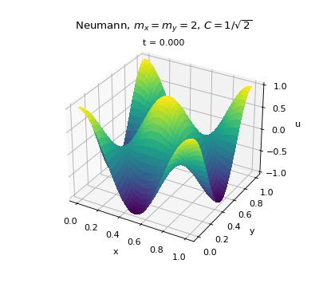

## 1.2.3 Exact solution of the wave equation

We consider

$$
\frac{\partial^2 u}{\partial t^2} = c^2 \nabla^2 u, \qquad \nabla^2 = \frac{\partial^2}{\partial x^2} + \frac{\partial^2}{\partial y^2},
$$

and insert $u(t,x,y) = e^{\imath(k_x x + k_y y - \omega t)}$. Each differentiation brings down a factor from the exponent:

$$
\frac{\partial^2 u}{\partial t^2} = (-\imath\omega)^2 u = -\omega^2 u, \qquad
\frac{\partial^2 u}{\partial x^2} = (\imath k_x)^2 u = -k_x^2 u, \qquad
\frac{\partial^2 u}{\partial y^2} = (\imath k_y)^2 u = -k_y^2 u .
$$

Inserting into the wave equation gives

$$
-\omega^2 u = -c^2\left(k_x^2 + k_y^2\right) u .
$$

Since $u \neq 0$ everywhere, the equation is satisfied exactly when

$$
\omega = c\sqrt{k_x^2 + k_y^2}.
$$

Hence $u = e^{\imath(k_x x + k_y y - \omega t)}$ is a solution of the wave equation for all $t, x, y$, provided that $\omega$ satisfies this dispersion relation. With $k_x = m_x\pi$ and $k_y = m_y\pi$ we get $\omega = c\pi\sqrt{m_x^2 + m_y^2}$, which is what the property `w` returns. Since the wave equation is linear and real, the real part of this solution, and products of sines and cosines built from it, also solve it. This covers the standing waves used for the Dirichlet and Neumann problems.

## 1.2.4 Numerical dispersion coefficient

The discretized equation at internal points is

$$
\frac{u^{n+1}_{ij} - 2u^n_{ij} + u^{n-1}_{ij}}{\Delta t^2}
= c^2\left(
\frac{u^n_{i+1,j} - 2u^n_{ij} + u^n_{i-1,j}}{h^2}
+ \frac{u^n_{i,j+1} - 2u^n_{ij} + u^n_{i,j-1}}{h^2}
\right).
$$

With $m_x = m_y$, so that $k_x = k_y = k$, we insert the discrete mesh function

$$
u^n_{ij} = e^{\imath\left(kh(i+j) - \tilde\omega n\Delta t\right)},
$$

where $\tilde\omega$ is the unknown numerical dispersion coefficient.

**Time derivative.** Shifting $n \to n \pm 1$ multiplies $u^n_{ij}$ by $e^{\mp\imath\tilde\omega\Delta t}$:

$$
u^{n+1}_{ij} - 2u^n_{ij} + u^{n-1}_{ij}
= \left(e^{-\imath\tilde\omega\Delta t} - 2 + e^{\imath\tilde\omega\Delta t}\right)u^n_{ij}
= 2\left(\cos(\tilde\omega\Delta t) - 1\right)u^n_{ij}
= -4\sin^2\!\left(\frac{\tilde\omega\Delta t}{2}\right)u^n_{ij},
$$

where we used $e^{\imath\theta} + e^{-\imath\theta} = 2\cos\theta$ and $1 - \cos\theta = 2\sin^2(\theta/2)$.

**Space derivatives.** In the same way, shifting $i \to i \pm 1$ (or $j \to j \pm 1$) multiplies by $e^{\pm\imath kh}$:

$$
u^n_{i+1,j} - 2u^n_{ij} + u^n_{i-1,j}
= u^n_{i,j+1} - 2u^n_{ij} + u^n_{i,j-1}
= -4\sin^2\!\left(\frac{kh}{2}\right)u^n_{ij}.
$$

**Inserting.** The discretized equation becomes

$$
-\frac{4}{\Delta t^2}\sin^2\!\left(\frac{\tilde\omega\Delta t}{2}\right)u^n_{ij}
= -\frac{8c^2}{h^2}\sin^2\!\left(\frac{kh}{2}\right)u^n_{ij}.
$$

Dividing by $-4u^n_{ij}/\Delta t^2$ and using the CFL number $C = c\Delta t/h$:

$$
\sin^2\!\left(\frac{\tilde\omega\Delta t}{2}\right) = 2C^2\sin^2\!\left(\frac{kh}{2}\right).
$$

**Choosing $C = 1/\sqrt{2}$.** Then $2C^2 = 1$ and

$$
\sin^2\!\left(\frac{\tilde\omega\Delta t}{2}\right) = \sin^2\!\left(\frac{kh}{2}\right)
\quad\Longrightarrow\quad
\tilde\omega\Delta t = kh,
$$

taking the branch where $\tilde\omega \to \omega$ as $h \to 0$. Hence

$$
\tilde\omega = \frac{kh}{\Delta t} = \frac{k c}{C} = \sqrt{2}\,c k .
$$

The exact dispersion coefficient from 1.2.3 with $k_x = k_y = k$ is

$$
\omega = c\sqrt{k^2 + k^2} = \sqrt{2}\,c k .
$$

Therefore $\tilde\omega = \omega$ when $C = 1/\sqrt{2}$ and $m_x = m_y$. The numerical scheme then has no dispersion error, and it reproduces the exact solution to machine precision. This is what `test_exact_wave2d` verifies: the $\ell^2$-error is below $10^{-12}$ for both the Dirichlet and the Neumann problem.

## 1.2.6 Animation

The animation below shows the Neumann problem with $m_x = m_y = 2$ and $C = 1/\sqrt{2}$ over one period $T = 2\pi/\omega$.

